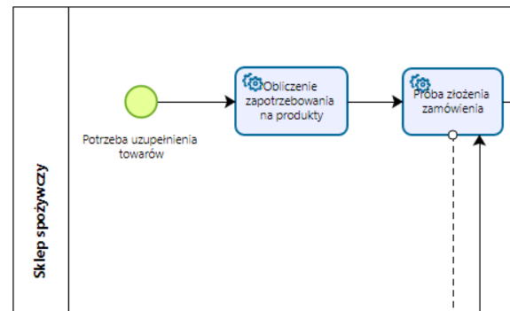
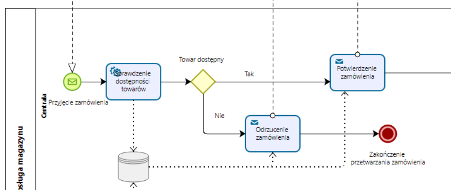
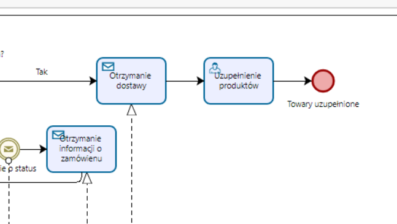
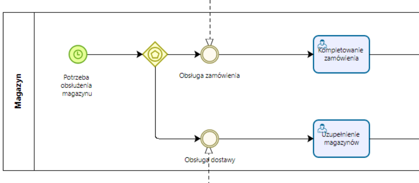
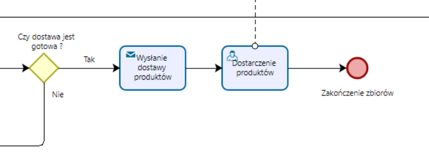
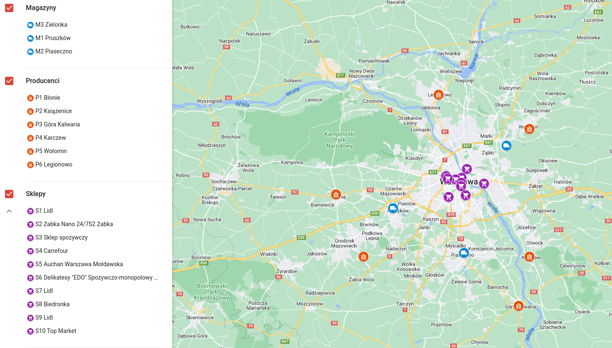
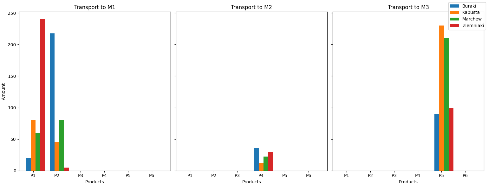
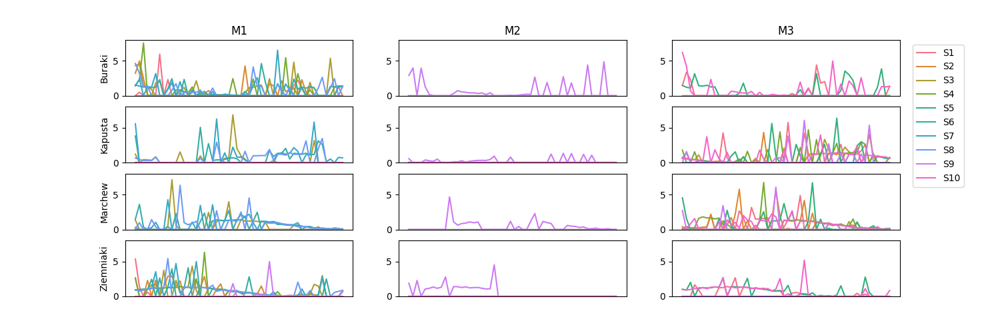
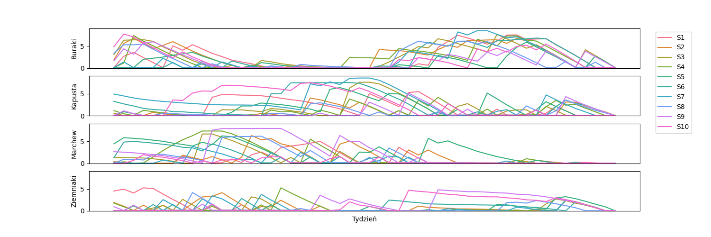

## Model BPMN

### Sklep spożywczy

Sklep liczy zapotrzebowanie na produkty według modelu optymalizacyjnego.\

Sklep kontaktuje się z obsługą magazynu w celu złożenia zamówienia. Obsługa oblicza transport warzyw z poszczególnych magazynów na podstawie modelu.\

Po otrzymaniu dostawy sklep uzupełnia towary.\

### Magazyn

Poszczególne magazyny uzupełniają zapasy otrzymane od producentów i dostarczają zamówienia do wyznaczonych przez obsługę sklepów.\

### Producent

Każdy producent oblicza transport produktów do poszczególnych magazynów według modelu optymalizacyjnego.\

## Lokalizacje

### Sklepy

Identyfikator | Adres sklepu | Współrzędne | Pojemność 
----| ---- | ---- | ----
S1 | Tamka 40, 00-355 Warszawa | 52.23674, 21.02147 | 5.54
S2 | Emilii Plater 53, 00-113 Warszawa | 52.23362, 21.00208 | 3.2
S3 | Hoża 9, 00-001 Warszawa | 52.22727, 21.0201 | 7.56
S4 | Targowa 72, 03-734 Warszawa | 52.25511, 21.03853 | 7.65
S5 | Mołdawska 7A, 02-132 Warszawa | 52.19857, 20.97797 | 7.73
S6 | Jana Długosza 19, 01-175 Warszawa | 52.24053, 20.97032 | 5.68
S7 | Wolska 19/25, 01-201 Warszawa | 52.23504, 20.97605 | 6.34
S8 | Dolna 3, 00-773 Warszawa | 52.20145, 21.03401 | 8.1
S9 | Generała Tadeusza Bora-Komorowskiego 14A, 03-982 Warszawa | 52.22491, 21.09574 | 6.48
S10 | aleja Wyzwolenia 16, 00-568 Warszawa | 52.21999, 21.01898 | 6.92

### Magazyny

Identyfikator | Adres magazynu | Współrzędne | Pojemność
----| ---- | ---- | ----
M1 | 05-800 Pruszków | 52.17542, 20.79532 | 1000
M2 | 05-500 Piaseczno | 52.08579, 21.02866 | 100
M3 | 05-220 Zielonka | 52.30194, 21.16922 | 850

### Producenci

Identyfikator | Adres producenta | Współrzędne
----| ---- | ---- 
P1 | 05-870 Błonie | 52.20375, 20.6072
P2 | 05-825 Książenice | 52.07816, 20.69791
P3 | 05-530 Góra Kalwaria | 51.97842, 21.20881
P4 | 05-480 Karczew | 52.07803, 21.24465
P5 | 05-200 Wołomin | 52.3351, 21.2448
P6 | 05-120 Legionowo | 52.40413, 20.94602

### Rozmieszczenie na mapie

- Dystanse między obiektami w modelu optymalizacyjnym były oszacowane dla ułatwienia obliczeń

## Wykresy zapotrzebowania na warzywa

- Zakładając że pierwszy tydzień jest pierwszym tygodniem roku.
- Różne sklepy mają większe lub mniejsze wachania zapotrzebowania. 
- Wszystkie wartości zostały ograniczone do przedziału [0, 2].
- Dane zostały wygenerowane za pomocą skryptu w języku python.

## Wynik optymalizacji

Całkowity koszt po minimalizacji wyniósł 210297

### Transport do magazynów

### Transport do sklepów

### Zapas w sklepach

